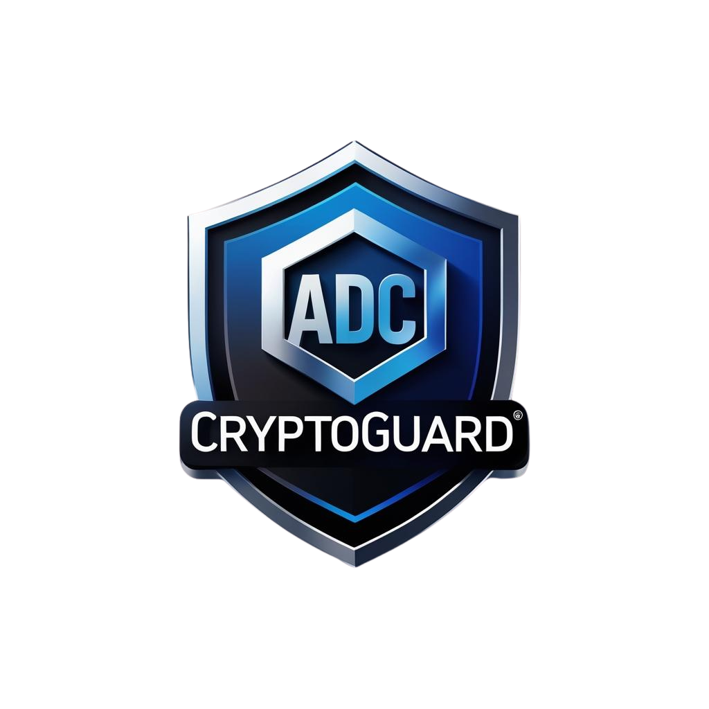

#   
# ADC Cryptoguard – Multi-Chain Wallet Security & Compliance Validator  

  
  
  
  
  
  
  
  
  
  
  

---

## 📌 Project Overview  

**ADC Cryptoguard** is a **multi-chain wallet security and compliance validator**.  
It validates blockchain addresses, detects anomalies or scam activity, and generates **ISO 20022-compliant audit exports** for banks, regulators, and enterprises.  

👤 **Development Model**  
Built and maintained by **ADCX Lab** with lean execution, rapid iteration, and transparent open-source governance.  

**Core Objectives:**  
- Protect users from scam & high-risk wallets  
- Provide audit-ready compliance reports (ISO 20022 XML)  
- Deliver AI-powered risk scoring with zero user data stored  
- Bridge **banks ↔ blockchain** through compliance-first design  

---

## 🔎 Active Modules  

- **XRPL Module (active):** address validation (`r...`), anomaly detection, risk scoring, ISO 20022 XML export  
- **Hedera Module (HGuard):** account validation (`0.0.xxxx`), risk scoring, ISO 20022 XML export  
- **Kadena Module (GuardianX – prototype):** wallet validation, API fallback, ISO export (stub)  
- **Planned:** Arbitrum, Base, and other EVM-compatible chains  

---

## 🖥️ Live Deployments  

- **XRPL Validator (ProetorX demo):** [Live](https://proetorx-xrpl.onrender.com) | [Repo](https://github.com/ADCoinX/ProetorX-xrpl)  
- **Hedera Validator (HGuard):** [Repo](https://github.com/ADCoinX/Hguard-Hedera)  
- **Kadena Validator (GuardianX):** [Repo](https://github.com/ADCoinX/GX-kadena)  

---

## 🗂️ Repository Structure  

core/            → AI risk engine, ISO exporter  
integrations/    → Chain-specific logic (XRPL, Hedera, Kadena, EVM)  
templates/       → Web frontend (HTML/CSS)  
static/          → Assets (logo, styles)  

---

## ⚙️ Technical Summary  

- **Frontend:** HTML + CSS  
- **Backend:** Python (Flask / FastAPI migration planned)  
- **AI Risk Engine:** Hybrid scoring (heuristics + anomaly rules, 0–100 scale)  
- **Data Sources:** Public RPCs & fallback explorers  
- **Compliance:** ISO 20022 XML export via `iso_export.py`  

---

## 🧩 System Architecture  

+——————+        +––––––––––+        +——————+  
|   User / Client  | —–> |  API Router        | —–> |  Public RPC/API  |  
| (Web UI / cURL)  |        |  (Flask/FastAPI)   |        |  (multi-chain)   |  
+——————+        +––––––––––+        +——————+  
|  
v  
+———————+  
|   AI Risk Engine    |  
|   (ai_risk.py)      |  
|  Score: 0 – 100     |  
+———————+  
|  
v  
+———————+  
|   ISO Exporter      |  
|   (iso_export.py)   |  
|  ISO 20022 XML Out  |  
+———————+  
|  
v  
+—————————––+  
|  JSON API Response + XML File |  
|  Reviewer / Compliance Output |  
+—————————––+  

---

## 🚀 Upgrade Plan  

### 🔥 AI Risk Engine  
- ML anomaly detection (unsupervised clustering)  
- Wallet-to-wallet graph analysis  
- Multi-factor scoring (age, tx diversity, blacklist, anomalies)  
- Reviewer dashboard → **explainable AI**  

### 🔥 ISO 20022 Export  
- Chain-specific ISO 20022 profiles  
- Multi-standard compliance (GDPR/PDPA)  
- Enterprise-ready integration (SAP, Oracle, Temenos)  
- Automated XML download in dashboard  

---

## 🌍 Enterprise Global Use  

**Target Users:**  
- Global banks & compliance teams → ISO 20022 bridging between blockchain & SWIFT/SEPA  
- Regulators & auditors → automated XML reporting  
- Exchanges & custodians → wallet risk scoring for onboarding/monitoring  
- Enterprises adopting tokenization (RWA, CBDCs)  

**Integration Examples:**  
- Direct API → plug into exchange compliance stack  
- Enterprise dashboards → real-time risk insights  
- XML export → importable into **core banking systems** (SAP, Oracle, Avaloq)  

**Global Alignment:**  
- **ISO/TC 307** standards  
- **EU MiCA** regulation  
- **MAS (Singapore)**, **BNM (Malaysia)** regulatory pilots  
- **SWIFT ISO 20022 migration** compatibility  

---

## 💰 Monetization Strategy  

1. **Freemium SaaS/API**  
   - Free tier → limited wallet validations  
   - Paid tier → unlimited validations, ISO export, priority APIs  

2. **Enterprise Licensing**  
   - Annual contracts with banks, exchanges, custodians  
   - White-label dashboards & private deployments  

3. **RegTech Partnerships**  
   - Collaborations with auditors, compliance firms  
   - Per-transaction or per-wallet validation fees  

4. **Custom Integrations**  
   - Tailored ISO 20022 mapping for specific jurisdictions  
   - Consulting revenue from regulatory sandboxes  

---

## 🔐 Security & Infosec  

At **ADCX Lab**, security and compliance are built in from day one.  
The validator is stateless, privacy-first, and designed to pass InfoSec due diligence.  

### ✅ Quality & Assurance  

  
  
  

**Principles:**  
- No storage of keys or PII  
- Public API calls only, with redundancy  
- Local, privacy-first execution  

---

## 📈 Roadmap  

- **M1** → Enhanced scam wallet heuristics  
- **M2** → Multi-chain tx anomaly detection  
- **M3** → ISO 20022 export (XRPL, Hedera, Kadena)  
- **M4** → Reviewer dashboard (risk visualization + ISO export)  
- **M5** → Mobile wallet checker (iOS/Android)  
- **M6** → Enterprise deployment (SaaS/API, banking integrations)  

---

## 👥 Team & Governance  

**Core Team**  
- **Muhammad Yusri Adib — Founder / CTO**  
  Focus: architecture, AI risk engine, ISO exporter, integrations  
  Commitment: Full-time  
  [LinkedIn](http://linkedin.com/in/muhammad-yusri-adib-455aa8b7)  

- **Muhammad Mustafa, CPA, CFE, CMA, CIA — Finance & Compliance Lead**  
  Focus: governance, audit & reporting, budget control, regulatory alignment  
  Commitment: Full-time  
  [LinkedIn](http://linkedin.com/in/muhammad-mustafa-abdulmanaf)  

**Governance & Quality**  
- `main` branch protected: peer reviews + CI checks  
- Secrets managed via GitHub Encrypted Secrets  
- No user data stored; validator is privacy-first  
- Vulnerability reporting per `SECURITY.md` (72h SLA for high-severity issues)  

---

## ⚠️ Disclaimer  

This tool is for **educational, research, and compliance validation** only.  
ADCX Lab does not provide financial, investment, or legal guarantees.  
Code is open-sourced under MIT License; provided as-is with no warranties.  

---

## 📜 License  
This project is open-sourced under the MIT License.  
See the [LICENSE](./LICENSE) file for details.  

---

## 📞 Contact  

👤 **Muhammad Yusri Adib**  
Founder – ADCX Lab  
📩 Email: admin@autodigitalcoin.com  
💬 Telegram: [@ADCoinhelpline](https://t.me/ADCoinhelpline)  
🐦 Twitter: [@AdCoinMy](https://twitter.com/AdCoinMy)  
🔗 LinkedIn: [Muhammad Yusri Adib](https://www.linkedin.com/in/muhammad-yusri-adib)  
